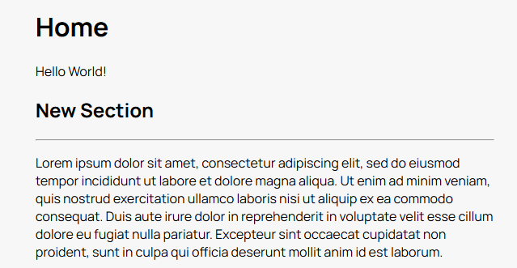

# Temple
Temple is a simple, extensible static site generator built on Typescript.
It allows you to build sites through fluent method chaining, making it easy to get up and running.

## Installation

install the `temple-ssg` package:
```
npm install temple-ssg
```

## Usage

A minimal Temple site is shown below:

```js
//site.js
import { Site, Temple } from 'temple-ssg'

const t = new Temple();
t.init(); // Set up build directory

const s = new Site();
s.page()
    .style("main.css") //Internal main theme stylesheet.
    .name("index") //Page filename

    //Page elements
    .title("Home")
    .paragraph("Hello World!")
    .section("New Section")
    .paragraph("Lorem ipsum dolor sit amet, consectetur adipiscing elit, sed do eiusmod tempor incididunt ut labore et dolore magna aliqua. Ut enim ad minim veniam, quis nostrud exercitation ullamco laboris nisi ut aliquip ex ea commodo consequat. Duis aute irure dolor in reprehenderit in voluptate velit esse cillum dolore eu fugiat nulla pariatur. Excepteur sint occaecat cupidatat non proident, sunt in culpa qui officia deserunt mollit anim id est laborum.");

s.build();

```
The above example builds the following site:  



